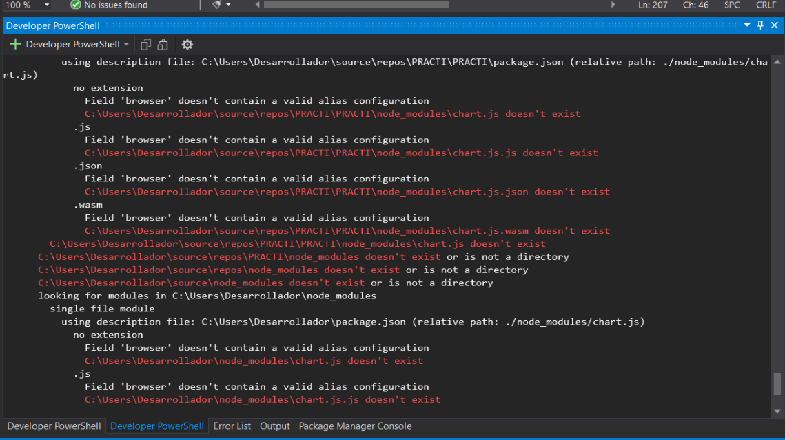

# Temas

## `-generate-theme-project`

Para facilitar la creación de temas dinámicos que JettraFlux detectará automáticamente a través de la arquitectura de plugins (`theme.json`), puedes utilizar el comando `-generate-theme-project`.

### Sintaxis

```bash
./mvn-flux -generate-theme-project <nombre-proyecto-plugin> -path <path-donde-se-creara el proyecto>  -url-source <url-template-example>
```

### Parámetros

- `<nombre-proyecto-plugin>`: El nombre de tu nuevo proyecto (ej. `SkyRed`). Esto creará una carpeta con el mismo nombre en tu espacio de trabajo.
- `-path`: Ruta donde se almacena el proyecto creado
- `-url-source`: (Opcional) Una URL de referencia que sirvió de inspiración para el diseño (ej. `https://primeui.store/templates/angular/freya`).
- `-css-source`: que es la ruta del archivo css si no se indica se asume que -url-source contiene el css dentro del.
- `-js-source`: Indica la ruta del archivo js del tema. Si no se especifica indica que -url-source contiene las instrucciones del archivo javascript.

Consideraciones:
* La pagina html incorpora los css y js de la plantilla. El sistema lo procesa de manera optima
* Si la pagina hmtl no incorpora css y js en el mismo archivo html, es recomendable usar -css-source y js-source para que el resultado sea optimizado.

### Ejemplo de Uso

```bash
./mvn-flux -generate-theme-project SkyRed -path ~/Descargas -url-source https://primeui.store/templates/angular/freya 
```

Al finalizar la ejecución, este comando creará un proyecto Maven independiente, empaquetado como `jar`, y con la carpeta `src/main/resources/META-INF/` conteniendo el archivo descriptor base **`theme.json`**. 

Luego, solo tendrás que entrar a la carpeta, modificar el `theme.json` para definir tus estilos, y compilar:

```bash
cd SkyRed
mvn clean install
```
Ingrese al proyecto y añáda la dependencia.
De manera automática se añade al selector de temas del proyecto.


EJEMPLOS DE USO:

```bash
./mvn-flux -generate-theme-project SkyRed -path ~/Descargas -url-source https://freya.primevue.org/
```

```bash
./mvn-flux -generate-theme-project AdminLTE -path ~/Descargas -url-source https://adminlte.io/themes/v4/
```

```bash
./mvn-flux -generate-theme-project Metis -path ~/Descargas  https://preview.colorlib.com/theme/metis/
```

```bash
./mvn-flux -generate-theme-project SkyRed -path ~/Descargas -css-source ./styles.css -js-source ./app.js
```


Estos temas se pueden subir a un repositorio de temas y colocar los enlaces para descargas.


## Creando el tema AdminLTE

Ejecute

```bash
./mvn-flux -generate-theme-project AdminLTE -path ~/Descargas -url-source https://adminlte.io/themes/v4/
```


Se muestra en consola el proceso realizado


Abra el proyecto en su IDE favorito


Cree el archivo jar del tema

```bash

mvn clean verify

```

Ahora vamos a probar el plugin abra un proyecto para integrarlo, en este caso usaremos JettraFluxExample, puede clonarlo mediante

```bash
git clone https://github.com/jettraframework/JettraFluxExample.git
```

Compile y ejecute el proyecto

```bash
mvn clean verify

java -jar target/JettraFluxExample-1.0-SNAPSHOT.jar 

```

Ingrese al navegador en la dirección [http://localhost:9010/jettrafluxexample/](http://localhost:9010/jettrafluxexample/).

Utilice las credenciales siguientes:

username: admin
password: admin

Se muestra el dashboard, seleccione en la parte superior la opción de temas, y se muestra el listado existente.


Edite el archivo pom.xml del proyecto JettraFluxExample y añada la dependencia que acaba de crear.

```xml
<dependency>
    <groupId>io.jettra.theme</groupId>
    <artifactId>adminlte</artifactId>
    <version>1.0.0</version>
    </dependency>

```

```bash
mvn clean verify

java -jar target/JettraFluxExample-1.0-SNAPSHOT.jar 

```

Ingrese al navegador en la dirección [http://localhost:9010/jettrafluxexample/](http://localhost:9010/jettrafluxexample/).

Utilice las credenciales siguientes:

username: admin
password: admin

Se muestra el dashboard, seleccione en la parte superior la opción de temas, y se muestra el listado existente y se añade de
manera automatica admin-lte


## Generando un tema usando Antigravity/Gemini IA

Escribe este prompt


Analiza el tema https://preview.colorlib.com/theme/metis/forms.html
y crea un proyecto java maven estilo themes similar a AdminLte este proyecto llamalo Metropolis, y debes asegurarte que los componentes de JettraFlux cuando se seleccione este tema tomen las caracteristicas


---

# Distribuyendo Temas

## Metroplis

* [https://github.com/jettraframework/Metropolis.git](https://github.com/jettraframework/Metropolis.git)

Genere la version distribuible

```bash
mvn clean verify

```
Cree en el repositorio de GitHub un release


Genere un nuevo distribuible en [https://jitpack.io/](https://jitpack.io/)




Observe que genera el repositorio y la dependencia lista para instalarse


```xml
<repositories>
    <repository>
        <id>jitpack.io</id>
        <url>https://jitpack.io</url>
    </repository>
</repositories>
```

```xml
<dependency>
    <groupId>com.github.jettraframework</groupId>
    <artifactId>Metropolis</artifactId>
    <version>1.0.0</version>
</dependency>
```

Añadalo a su proyecto Jettra y tendra el plugin configurado y listo para funcionar.


## Bit
[https://github.com/jettraframework/Bit.git](https://github.com/jettraframework/Bit.git)

Realice los mismos pasos descritos para Metropolis
```xml
<repositories>
    <repository>
        <id>jitpack.io</id>
        <url>https://jitpack.io</url>
    </repository>
</repositories>
```

```xml
<dependency>
    <groupId>com.github.jettraframework</groupId>
    <artifactId>Bit</artifactId>
    <version>1.0.0</version>
</dependency>
```