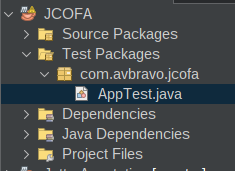
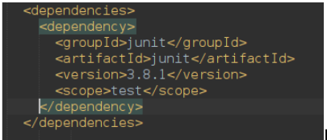
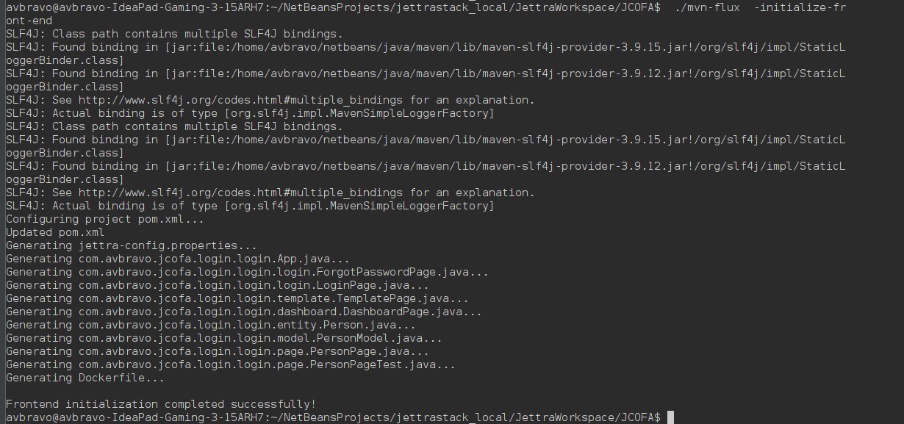
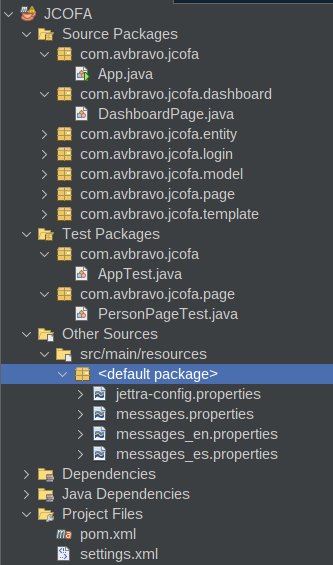
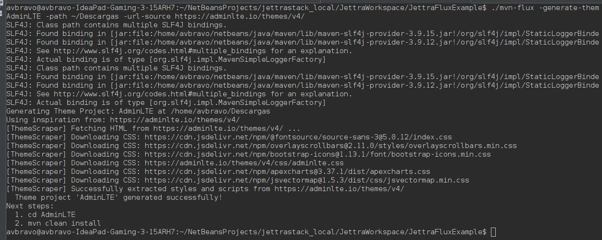
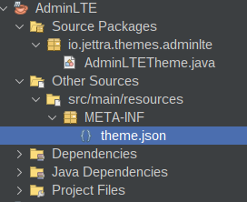
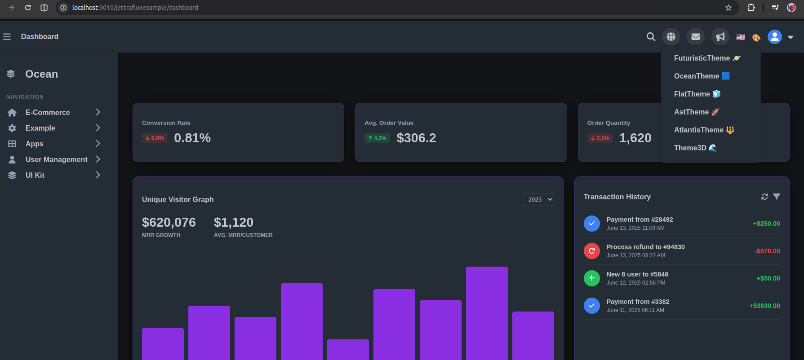
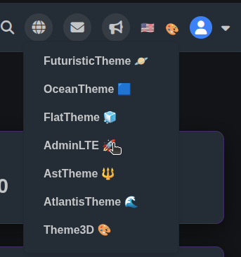

# mvn-flux CLI

`mvn-flux` es una herramienta de línea de comandos integrada en el ecosistema Jettra que facilita la generación de código y utilidades específicas para el framework **JettraFlux**. 

Mientras que `mvn-jettra` se enfoca en la administración y gestión del ciclo de vida de los plugins, `mvn-flux` está diseñado para agilizar el desarrollo de aplicaciones web escribiendo código repetitivo por ti.

Este script es autogenerado por JettraAppServer en la raíz de tu proyecto cuando inicias el servidor por primera vez, al igual que `mvn-jettra`.


## **Comandos Disponibles**

```shell
./mvn-flux <comando> [parámetros/opciones]
```

| Comando | Descripción |        |       |
| :----   |       :---- |  :---- | :---- |
| help                   | Muestra la ayuda de los comandos disponibles.                         |  |
| -create-code           | Genera código fuente automáticamente a partir de entidades (records). |  |
| -initialize-front-end  |   Inicializa la estructura frontend completa del proyecto pom.xml, jettra-config.properties, App.java y paquetes.                                                                    |  |


 ## -create-code 
    Genera código fuente automáticamente a partir de entidades (records).
* -source-record <FQN>:            Especifica la ruta completa (Fully Qualified Name) de un record.
                                  (Ejemplo: com.example.entity.Person)
                                  Alias: -from-record, source-record, from-record

*  -source-package-record <Pkg>:    Especifica el paquete para procesar masivamente todos sus records.
                                  (Ejemplo: com.example.entity)
                                  Alias: -from-package-record, source-package-record, from-package-record

* -model                          [Requerido] Genera la clase ViewModel (<Nombre>Model.java).
* -properties                     Escanea y actualiza los archivos messages*.properties con las etiquetas.
*  -converter                      Genera la clase conversora (<Nombre>ModelConverter.java).
*  -rest                           Genera la interfaz cliente REST (<Nombre>RestClient.java).
*  -services                       Genera la clase de servicio (<Nombre>Service.java).
*  -page                           Genera la página básica (<Nombre>Page.java).
*  -page-crud                      Genera la página CRUD completa (<Nombre>CrudPage.java).
*  -test-rest                      Genera las pruebas para los clientes REST.
*  -test-service                   Genera las pruebas para los servicios.
*  -test-page                      Genera las pruebas para las páginas.
*  -repository                     Genera el repositorio (Interface e Impl) para un record.
*  -controller                     Genera el controlador REST para un record.


## Comando: `-initialize-front-end`

El comando `-initialize-front-end` permite inicializar automáticamente la estructura frontend de un proyecto nuevo generado con Maven Archetype (por ejemplo, `maven-archetype-quickstart`).

### Flujo de Uso

1. Crear un proyecto nuevo con Maven:
```bash
mvn archetype:generate \
    -DgroupId=com.example.web \
    -DartifactId=MiExample \
    -DarchetypeArtifactId=maven-archetype-quickstart \
    -DinteractiveMode=false
```

2. Añadir la dependencia de `JettraAppServer` en el `pom.xml`.

3. Ejecutar el comando de inicialización:
```bash
./mvn-flux -initialize-front-end
```

### ¿Qué realiza este comando?

- **Configuración de `pom.xml`**: Actualiza el archivo `pom.xml` configurando las propiedades Java 25, dependencias de Jettra (`JettraAppServer`, `JettraFlux`, `JettraJSON`, `JettraRules`, `JettraJWT`, `JettraRest`, `JettraAnnotation`, `JettraTest`), plugins de compilación/shade y el repositorio `jitpack.io`.
- **Generación de propiedades**: Crea en `src/main/resources/` los archivos:
  - `jettra-config.properties` tomando la información de `<groupId>`, `<artifactId>`, `<version>`, `<name>` del `pom.xml`.
  - `messages.properties`, `messages_es.properties` y `messages_en.properties`.
- **Clase Principal (`App.java`)**: Crea en el paquete principal la clase `App.java` con toda la configuración del servidor web empotrado, OpenAPI y enrutamiento.
- **Estructura de Paquetes y Clases Autogeneradas**:
  - `login/`: Genera `LoginPage.java` y `ForgotPasswordPage.java`.
  - `template/`: Genera `TemplatePage.java`.
  - `dashboard/`: Genera `DashboardPage.java`.
  - `entity/`: Genera `Person.java`.
  - `model/`: Genera `PersonModel.java`.
  - `page/`: Genera `PersonPage.java`.

## Comando: `-create-code`

El comando principal de `mvn-flux` es `-create-code`, que te permite generar clases `ViewModel` complejas de forma completamente automática a partir de tus entidades (`records`).

### Sintaxis

**Por un Record específico:**
```bash
./mvn-flux -create-code -source-record <Paquete.Record> -model [-properties] [-converter] [-rest] [-services] [-page] [-page-crud] [-test-rest] [-test-service] [-test-page]
```

**Por todo un paquete de Records:**
```bash
./mvn-flux -create-code -source-package-record <Paquete> -model [-properties] [-converter] [-rest] [-services] [-page] [-page-crud] [-test-rest] [-test-service] [-test-page]
```

### Opciones de Origen (`-source-record` / `-source-package-record`)

- **`-source-record <Paquete.Record>`** (o `-from-record`): Recibe la ruta absoluta (Fully Qualified Name) de una clase `record` específica.
- **`-source-package-record <Paquete>`** (o `-from-package-record`): Recibe el paquete de trabajo (ej. `com.example.entity`). Escanea y toma todos los `records` presentes en ese paquete para aplicar masivamente la generación según los parámetros indicados.

### Ejemplo de Uso

**1. Generación por un Record individual:**
Supongamos que tienes una entidad (record) `Person` en el paquete `com.miempresa.proyecto.entity`:

```bash
./mvn-flux -create-code -source-record com.miempresa.proyecto.entity.Person -model -properties -converter -rest -services -page-crud -test-rest -test-service -test-page
```

**2. Generación masiva por Paquete de Records:**
Para procesar automáticamente todos los `records` dentro del paquete `com.miempresa.proyecto.entity`:

```bash
./mvn-flux -create-code -source-package-record com.miempresa.proyecto.entity -model -properties -converter -rest -services -page-crud -test-rest -test-service -test-page
```

Esto analizará las entidades del paquete e implementará sus correspondientes `ViewModel` (e.g. `PersonModel.java`) en el paquete `com.miempresa.proyecto.model`. Además, si se incluye `-properties`, escaneará todos los archivos `messages*.properties` (multilenguaje) en la carpeta `src/main/resources/` y añadirá automáticamente las etiquetas correspondientes a los atributos de cada récord.

Por ejemplo, si `Person` tiene un `UUID id` y un `String name`, se añadirá automáticamente a tus archivos properties:
```properties
person.id = Id
person.name = Name
```

### ¿Qué hace internamente?

1. **Inferencia de Paquetes**: Asume de manera inteligente que si tu récord está en un subpaquete `.entity`, el ViewModel debe residir en `.model`. De igual manera, asume que los servicios residen en `.services`, clientes REST en `.restclient`, páginas en `.pages`.
2. **Generación de Selectores Visuales**: 
   - Transforma atributos básicos (como `String`, `Integer`) en campos simples con sus respectivas anotaciones `@PropertiesInRecord`, `@PropertiesLabel` y validaciones (`@NotNull`).
   - Identifica atributos complejos (relaciones con otras clases) y genera selectores de vista única (`@ViewSelectOne`).
   - Identifica colecciones (ej. `List<Department>`) y genera selectores de vista múltiple (`@ViewSelectMany`) referenciando directamente a los servicios.
3. **Conversor Bidireccional (Opcional)**: Si añades el flag `-converter`, el CLI generará explícitamente la clase `PersonModelConverter.java` en el paquete `.converter`. Esto es útil para evitar errores de IDE al inyectar esta clase en otras. Si no pasas este flag, podrás usar anotaciones (como `@FluxModelToRecordConversor`) o crearlo manualmente si prefieres el modo clásico.
4. **Cliente REST (Opcional)**: Si añades el flag `-rest`, generará automáticamente una interfaz `@RestClient` (`PersonRestClient.java`) en el paquete `.restclient` para conectarse a tus APIs, con métodos de CRUD básicos (`findAll`, `save`, `update`, `delete`) y consultas dinámicas `findBy<NombreAtributo>` por cada campo del record.
5. **Servicio Lógico (Opcional)**: Si añades el flag `-services`, generará una clase de servicio (`PersonService.java`) en el paquete `.services` configurada con `@Inject` inyectando tu `PersonRestClient` lista para ser utilizada.
6. **Vistas / Páginas (Opcional)**: Si añades el flag `-page`, generará una página en blanco adaptada al record. Si en cambio añades el flag `-page-crud`, se construirá un CRUD visual completo (`PersonCrudPage.java`) con DataTable, paginación, modales, etc.
7. **Pruebas Unitarias/Integración (Opcional)**: Con los flags `-test-rest`, `-test-service`, y `-test-page`, se generarán las estructuras de prueba en `src/test/java` para las correspondientes capas de tu aplicación.

## Comando: `-help`

Para consultar el menú de ayuda con la explicación detallada de todos los comandos, parámetros y ejemplos desde la consola, ejecuta:

```bash
./mvn-flux -help
```

*(También puedes utilizar `help`, `--help` o `-h`).*

---

*Nota: Para que la generación de código funcione correctamente, asegúrate de invocar `mvn-flux` en la raíz del proyecto que contiene los archivos fuente de tu entidad, ya que el CLI utiliza el classpath y las rutas locales del proyecto para ubicar y escribir los archivos de Java.*


---
# -initialize-front-end

## **Introducción**

Genera el esqueleto funcional de un proyecto Jettra-Flux, con las configuraciones mínimas.

## Creación del proyecto llamado: 

Este capítulo trata de la creación de un proyecto Java utilizando el stack Jettra, configurando base de datos y endpoints, utilizando OpenAPI mediante una implementación propia de Swagger-ui.

A continuación los pasos a seguir:

* Desde consola creamos el proyecto Java Maven mediante el comando

```java
mvn archetype:generate \
    -DgroupId=com.avbravo.jcofa \
    -DartifactId=JCOFA \
    -DarchetypeArtifactId=maven-archetype-quickstart \
    -DinteractiveMode=false

```

Al finalizar el proceso se crea el proyecto JCOFA Utilice su editor preferido para abrir el proyecto




Edite la clase AppTest.java, elimine el código de manera que quede de la siguiente manera:

```java
package com.avbravo.facoweb;
/**
 * Unit test for simple App.
 */
public class AppTest {
 
}

```

Edite el archivo pom.xml y elimine la dependencia de JUnit.




Añada las propiedades

```xml
<properties>
        <maven.compiler.source>25</maven.compiler.source>
        <maven.compiler.target>25</maven.compiler.target>
        <project.build.sourceEncoding>UTF-8</project.build.sourceEncoding>
        <skipTests>true</skipTests>
        <!-- Main Class -->
        <main.class.path>com.avbravo.jcofa.App</main.class.path>
        <!-- Versions-->
        <jettra.appserver.version>1.0.0-SNAPSHOT</jettra.appserver.version>
    
    </properties>

```

Añada el repository

```xml
<repositories>
   <repository>
	  <id>jitpack.io</id>
	  <url>https://jitpack.io</url>
   </repository>
</repositories>
```


Añada la dependencia

```xml
<dependencies>
    <dependency>
       <groupId>io.jettra</groupId>
       <artifactId>JettraAppServer</artifactId>
       <version>${jettra.appserver.version}</version>
    </dependency>
</dependencies>
```


Resultado final archivo pom.xml

```xml

<project xmlns="http://maven.apache.org/POM/4.0.0" xmlns:xsi="http://www.w3.org/2001/XMLSchema-instance"
         xsi:schemaLocation="http://maven.apache.org/POM/4.0.0 http://maven.apache.org/maven-v4_0_0.xsd">
    <modelVersion>4.0.0</modelVersion>
    <groupId>com.avbravo.jcofa</groupId>
    <artifactId>JCOFA</artifactId>
    <packaging>jar</packaging>
    <version>1.0-SNAPSHOT</version>
    <name>JCOFA</name>
    <url>http://maven.apache.org</url>
    <properties>
        <maven.compiler.source>25</maven.compiler.source>
        <maven.compiler.target>25</maven.compiler.target>
        <project.build.sourceEncoding>UTF-8</project.build.sourceEncoding>
        <skipTests>true</skipTests>
        <!-- Main Class -->
        <main.class.path>com.avbravo.facoweb.App</main.class.path>
        <!-- Versions-->
        <jettra.appserver.version>1.0.0-SNAPSHOT</jettra.appserver.version>
    
    </properties>

    <dependencies>
        <dependency>
            <groupId>io.jettra</groupId>
            <artifactId>JettraAppServer</artifactId>
            <version>${jettra.appserver.version}</version>
        </dependency>

    </dependencies>

    <repositories>
        <repository>
            <id>jitpack.io</id>
            <url>https://jitpack.io</url>
        </repository>
    </repositories>

</project>
```

Compile el proyecto mediante

```shell
cd JCOFA

mvn clean verify
```

## Generar los archivos mvn-flux y mvn-jettra

```shell

mvn exec:java -Dexec.mainClass="io.jettra.server.JettraServer" -Dexec.args="-generate-flux-jettra-sh"

```
Esta instrucción genera de manera automática los archivos mvn-flux y mvn-jettra.


Archivo: mvn-flux

```shell
#!/bin/bash
if [ "$1" = "-flux" ]; then
    shift
fi

# Execute the CLI tool using the local pom.xml
mvn -q exec:java -Dexec.mainClass="io.jettra.server.cli.FluxCLI" -Dexec.args="$*"

```

Archivo: mvn-jettra

```shell
#!/bin/bash
if [ "$1" = "-jettra" ]; then
    shift
fi

# Execute the CLI tool using the local pom.xml
mvn -q exec:java -Dexec.mainClass="io.jettra.server.cli.PluginCLI" -Dexec.args="$*"

```

De permisos a los archivos

```shell
chmod 775  mvn-flux
chmod 755  mvn-jettra
```

Ejecute el inicializador para una aplicación front-end mediante

```shell
 ./mvn-flux  -initialize-front-end   

```

Se muestra la salida en consola de la generación del esqueleto del proyecto.




Al finalizar la ejecución de -initialize-front-end , se observa que se crearon las clases, los archivos de propiedades, las configuraciones
del proyecto, se  crea la plantilla. el login y un formulario de ejemplo.




---

## `-generate-theme-project`

Para facilitar la creación de temas dinámicos que JettraFlux detectará automáticamente a través de la arquitectura de plugins (`theme.json`), puedes utilizar el comando `-generate-theme-project`.

### Sintaxis

```bash
./mvn-flux -generate-theme-project <nombre-proyecto-plugin> -path <path-donde-se-creara el proyecto>  -url-source <url-template-example>
```

### Parámetros

- `<nombre-proyecto-plugin>`: El nombre de tu nuevo proyecto (ej. `SkyRed`). Esto creará una carpeta con el mismo nombre en tu espacio de trabajo.
- `-path`: Ruta donde se almacena el proyecto creado
- `-url-source`: (Opcional) Una URL de referencia que sirvió de inspiración para el diseño (ej. `https://primeui.store/templates/angular/freya`).
- `-css-source`: que es la ruta del archivo css si no se indica se asume que -url-source contiene el css dentro del.
- `-js-source`: Indica la ruta del archivo js del tema. Si no se especifica indica que -url-source contiene las instrucciones del archivo javascript.

Consideraciones:
* La pagina html incorpora los css y js de la plantilla. El sistema lo procesa de manera optima
* Si la pagina hmtl no incorpora css y js en el mismo archivo html, es recomendable usar -css-source y js-source para que el resultado sea optimizado.

### Ejemplo de Uso

```bash
./mvn-flux -generate-theme-project SkyRed -path ~/Descargas -url-source https://primeui.store/templates/angular/freya 
```

Al finalizar la ejecución, este comando creará un proyecto Maven independiente, empaquetado como `jar`, y con la carpeta `src/main/resources/META-INF/` conteniendo el archivo descriptor base **`theme.json`**. 

Luego, solo tendrás que entrar a la carpeta, modificar el `theme.json` para definir tus estilos, y compilar:

```bash
cd SkyRed
mvn clean install
```
Ingrese al proyecto y añáda la dependencia.
De manera automática se añade al selector de temas del proyecto.


EJEMPLOS DE USO:

```bash
./mvn-flux -generate-theme-project SkyRed -path ~/Descargas -url-source https://freya.primevue.org/
```

```bash
./mvn-flux -generate-theme-project AdminLTE -path ~/Descargas -url-source https://adminlte.io/themes/v4/
```

```bash
./mvn-flux -generate-theme-project Metis -path ~/Descargas  https://preview.colorlib.com/theme/metis/
```

```bash
./mvn-flux -generate-theme-project SkyRed -path ~/Descargas -css-source ./styles.css -js-source ./app.js
```


Estos temas se pueden subir a un repositorio de temas y colocar los enlaces para descargas.


## Creando el tema AdminLTE

Ejecute

```bash
./mvn-flux -generate-theme-project AdminLTE -path ~/Descargas -url-source https://adminlte.io/themes/v4/
```


Se muestra en consola el proceso realizado




Abra el proyecto en su IDE favorito




Cree el archivo jar del tema

```bash

mvn clean verify

```

Ahora vamos a probar el plugin abra un proyecto para integrarlo, en este caso usaremos JettraFluxExample, puede clonarlo mediante

```bash
git clone https://github.com/jettraframework/JettraFluxExample.git
```

Compile y ejecute el proyecto

```bash
mvn clean verify

java -jar target/JettraFluxExample-1.0-SNAPSHOT.jar 

```

Ingrese al navegador en la dirección [http://localhost:9010/jettrafluxexample/](http://localhost:9010/jettrafluxexample/).

Utilice las credenciales siguientes:

username: admin
password: admin

Se muestra el dashboard, seleccione en la parte superior la opción de temas, y se muestra el listado existente.





Edite el archivo pom.xml del proyecto JettraFluxExample y añada la dependencia que acaba de crear.

```xml
<dependency>
    <groupId>io.jettra.theme</groupId>
    <artifactId>adminlte</artifactId>
    <version>1.0.0</version>
    </dependency>

```

```bash
mvn clean verify

java -jar target/JettraFluxExample-1.0-SNAPSHOT.jar 

```

Ingrese al navegador en la dirección [http://localhost:9010/jettrafluxexample/](http://localhost:9010/jettrafluxexample/).

Utilice las credenciales siguientes:

username: admin
password: admin

Se muestra el dashboard, seleccione en la parte superior la opción de temas, y se muestra el listado existente y se añade de
manera automatica admin-lte




## Generando un tema usando Antigravity/Gemini IA

Escribe este prompt


Analiza el tema https://preview.colorlib.com/theme/metis/forms.html
y crea un proyecto java maven estilo themes similar a AdminLte este proyecto llamalo Metropolis, y debes asegurarte que los componentes de JettraFlux cuando se seleccione este tema tomen las caracteristicas


---

# Distribuyendo Temas

## Metroplis

* [https://github.com/jettraframework/Metropolis.git](https://github.com/jettraframework/Metropolis.git)

Genere la version distribuible

```bash
mvn clean verify

```
Cree en el repositorio de GitHub un release


Genere un nuevo distribuible en [https://jitpack.io/](https://jitpack.io/)


Observe que genera el repositorio y la dependencia lista para instalarse


```xml
<repositories>
    <repository>
        <id>jitpack.io</id>
        <url>https://jitpack.io</url>
    </repository>
</repositories>
```

```xml
<dependency>
    <groupId>com.github.jettraframework</groupId>
    <artifactId>Metropolis</artifactId>
    <version>1.0.0</version>
</dependency>
```

Añadalo a su proyecto Jettra y tendra el plugin configurado y listo para funcionar.


## Bit
[https://github.com/jettraframework/Bit.git](https://github.com/jettraframework/Bit.git)